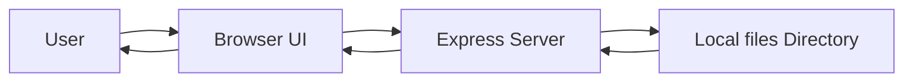

# Handon

[](https://nodejs.org/)
[](https://expressjs.com/)
[](https://ejs.co/)
[](https://tailwindcss.com/)

Handon is a lightweight note-taking web application built with Node.js, Express, and EJS. It allows users to create simple text notes, view them in a clean interface, and rename them locally without requiring a database or complex setup. The project is well-suited for beginners learning full-stack development, students organizing quick ideas, or anyone who wants a minimal personal notes app.

## Table of Contents

- [Features](#features)
- [Tech Stack](#tech-stack)
- [Project Architecture](#project-architecture)
- [How It Works](#how-it-works)
- [Installation](#installation)
- [Environment Variables](#environment-variables)
- [API Documentation](#api-documentation)
- [Database](#database)
- [Authentication](#authentication)
- [Folder Structure](#folder-structure)
- [Configuration](#configuration)
- [Performance Features](#performance-features)
- [Security Features](#security-features)
- [Future Improvements](#future-improvements)
- [Contributing](#contributing)
- [Author](#author)
- [Acknowledgements](#acknowledgements)

## Features

### Core Functionality

- Create new notes or task entries through a simple form
- View a list of existing notes on the home page
- Open individual note pages to read the stored content
- Rename note filenames from an edit screen
- Persist notes as local text files on disk

### User Experience

- Clean, responsive dark UI built with Tailwind CSS
- Simple navigation between home, read, and edit views
- No setup beyond installing dependencies and starting the server

## Tech Stack

### Frontend

- HTML5
- EJS templates
- Tailwind CSS via CDN

### Backend

- Node.js
- Express.js

### Database

- None currently implemented
- Notes are stored as plain text files in the local files directory

### Styling

- Tailwind CSS

### APIs

- Express routes for page rendering and form handling

### Libraries

- express
- ejs
- nodemon

### Dev Tools

- npm
- nodemon

## Project Architecture

The application follows a minimal server-rendered architecture:

- The main server entry point is index.js
- EJS templates live in the views directory
- Static assets are served from public
- Note content is stored in files as .txt files

A simplified structure looks like this:

```text
index.js
views/
  edit.ejs
  pure.ejs
  show.ejs
public/
files/
```

### Purpose of each major folder

- index.js: Starts the Express server and defines all routes
- views/: Contains the EJS templates for the home, view, and edit pages
- public/: Stores static assets that can be served by Express
- files/: Stores the persisted note files on disk

## How It Works



The workflow is straightforward:

1. The user visits the homepage
2. The server reads the existing note files from the files directory
3. The home page displays a list of available notes
4. The user can create a new note, view it, or rename it
5. The server writes or renames files on disk and renders the updated view

## Installation

Clone the repository and install dependencies:

```bash
git clone <repository-url>
cd note-making-website
npm install
```

Run the app locally:

```bash
node index.js
```

For development with auto-reload:

```bash
npx nodemon index.js
```

Then open your browser at:

```text
http://localhost:3000
```

## Environment Variables

No environment variables are required for the current version of this project.

| Variable | Description                                                    | Required |
| -------- | -------------------------------------------------------------- | -------- |
| None     | The app currently runs without environment-based configuration | No       |

## API Documentation

This project uses server-rendered routes rather than a JSON REST API.

| Method | Endpoint         | Description                                            | Authentication |
| ------ | ---------------- | ------------------------------------------------------ | -------------- |
| GET    | /                | Displays the home page with the list of note files     | None           |
| POST   | /create          | Creates a new note file from form input                | None           |
| GET    | /files/:filename | Renders a page showing the contents of a specific note | None           |
| GET    | /edit/:filename  | Displays the rename form for a given note              | None           |
| POST   | /edit            | Renames an existing note file                          | None           |

### Example request payloads

Create a note:

```json
{
  "title": "Meeting Notes",
  "description": "Discuss project timeline"
}
```

Rename a note:

```json
{
  "prev": "MeetingNotes.txt",
  "new": "Project Timeline"
}
```

## Database

No database is currently configured.

| Component      | Status           | Notes                                       |
| -------------- | ---------------- | ------------------------------------------- |
| Database       | Not implemented  | The app uses the local filesystem instead   |
| Storage format | Plain text files | Files are written to the files directory    |
| Relationships  | None             | Each note is stored as a separate text file |

## Authentication

Authentication is not implemented in the current version.

- No login or registration flow exists
- No user accounts are stored
- All routes are publicly accessible while the server is running

## Folder Structure

```text
.
├── files/
├── public/
├── views/
├── index.js
├── package.json
├── package-lock.json
└── README.md
```

### Important folders

- files/: Stores note text files created by users
- public/: Contains static assets served by Express
- views/: Contains EJS templates for the UI

## Configuration

There is no additional build pipeline or container configuration in the repository at this time.

- Node.js is used directly to run the application
- Express handles routing and templating
- Tailwind CSS is loaded through a CDN script in the templates

## Performance Features

This project is intentionally minimal and does not currently implement advanced performance optimizations.

- Static assets are served directly by Express
- Notes are read and written from disk as needed

## Security Features

The current implementation is best suited for local development and small personal use.

- Basic form parsing is enabled
- File names are derived from input and normalized by removing spaces

## Future Improvements

Potential next steps for the project include:

- Allow editing the content of an existing note, not just the filename
- Introduce a real database such as MongoDB or SQLite
- Add search and tagging features
- Implement authentication and user accounts
- Add validation and better error handling
- Improve the UI with pagination and richer note formatting

## Contributing

Contributions are welcome.

1. Fork the repository
2. Create a feature branch
3. Make your changes
4. Open a pull request with a clear description of the improvement

If you are unsure where to start, a good first contribution would be adding note deletion or content editing.

## Author

Built by Nikhil Thakur.

- GitHub:  https://github.com/nikdotdev
- LinkedIn: https://www.linkedin.com/in/nikhil-thakur-39574b311/
- Portfolio: https://www.nikhilthakur.tech/

## Acknowledgements

This project makes use of the following open-source tools and libraries:

- Node.js
- Express
- EJS
- Tailwind CSS
- nodemon
